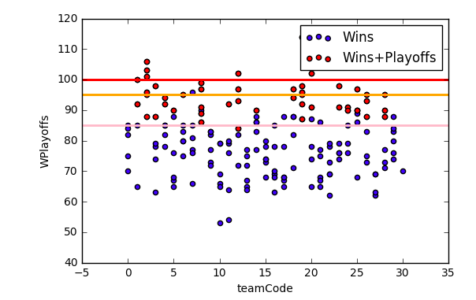
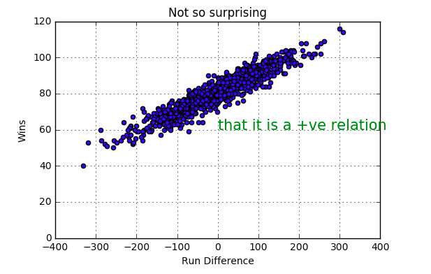

# logistic-regression-python
# linear-regression-python
#### import the pandas,numpy,matplotlib.pyplot packages and load the data, read the data to check the variables.
```
import pandas as pd
import matplotlib.pyplot as plt
import numpy as np
# Read data
df = pd.read_csv('baseball.csv')
df.head()
```
##### PLOT the benchmark wins
```
mydf = df.loc[(df.Year >= 1996) & (df.Year <= 2001), ['Team', 'W', 'Playoffs']]
```
#### How many records in mydf

#### Get unique team names
```
team_list = list(mydf.Team.unique())
```
#### See what team_list looks like

#### Create team code column
```
import math
teamCode = []
```
#### For each row in the column,
```
for row in mydf['Team']:
    code = team_list.index(row)
    if code >= 0:
        teamCode.append(code)
    else:
        # Append a nan
        teamCode.append(math.nan)
``` 
#### Create a column in the data frame from the list
```
mydf['teamCode'] = teamCode
```
#### Create a new column 'Wins given gone to playoffs'
```
mydf['WPlayoffs'] = np.where(mydf['Playoffs']==1, mydf['W'], float('nan'))
```

#### Clear plot
```
plt.clf()
```
#### https://github.com/pydata/pandas/issues/9909
#### 2 y axes
#### secondary axis does not work on scatter plot
```
ax=mydf.plot(kind='scatter',x='teamCode',y='W',label='Wins',color='blue')
mydf.plot(kind='scatter',x='teamCode',y='WPlayoffs',label='Wins+Playoffs',color='red', \
    ax=ax,secondary_y=True)
plt.axhline(y=95, color = 'orange', linewidth=2)
plt.axhline(y=85, color = 'pink', linewidth=2)
plt.axhline(y=100, color = 'red', linewidth=2)
plt.show()
```
['ANA', 'ARI', 'ATL', 'BAL', 'BOS', 'CHC', 'CHW', 'CIN', 'CLE', 'COL', 'DET', 'FLA', 'HOU', 'KCR', 'LAD', 'MIL', 'MIN', 'MON', 'NYM', 'NYY', 'OAK', 'PHI', 'PIT', 'SDP', 'SEA', 'SFG', 'STL', 'TBD', 'TEX', 'TOR', 'CAL']
    Team    W  Playoffs  teamCode  WPlayoffs
330  ANA   75         0         0        NaN
331  ARI   92         1         1       92.0
332  ATL   88         1         2       88.0
333  BAL   63         0         3        NaN
334  BOS   82         0         4        NaN
335  CHC   88         0         5        NaN
336  CHW   83         0         6        NaN
337  CIN   66         0         7        NaN
338  CLE   91         1         8       91.0
339  COL   73         0         9        NaN
340  DET   66         0        10        NaN
341  FLA   76         0        11        NaN
342  HOU   93         1        12       93.0
343  KCR   65         0        13        NaN
344  LAD   86         0        14        NaN
345  MIL   68         0        15        NaN
346  MIN   85         0        16        NaN
347  MON   68         0        17        NaN
348  NYM   82         0        18        NaN
349  NYY   95         1        19       95.0
350  OAK  102         1        20      102.0
351  PHI   86         0        21        NaN
352  PIT   62         0        22        NaN
353  SDP   79         0        23        NaN
354  SEA  116         1        24      116.0
355  SFG   90         0        25        NaN
356  STL   93         1        26       93.0
357  TBD   62         0        27        NaN
358  TEX   73         0        28        NaN
359  TOR   80         0        29        NaN
..   ...  ...       ...       ...        ...
476  TEX   77         0        28        NaN
477  TOR   76         0        29        NaN
478  ATL   96         1         2       96.0
479  BAL   88         1         3       88.0
480  BOS   85         0         4        NaN
481  CAL   70         0        30        NaN
482  CHC   76         0         5        NaN
483  CHW   85         0         6        NaN
484  CIN   81         0         7        NaN
485  CLE   99         1         8       99.0
486  COL   83         0         9        NaN
487  DET   53         0        10        NaN
488  FLA   80         0        11        NaN
489  HOU   82         0        12        NaN
490  KCR   75         0        13        NaN
491  LAD   90         1        14       90.0
492  MIL   80         0        15        NaN
493  MIN   78         0        16        NaN
494  MON   88         0        17        NaN
495  NYM   71         0        18        NaN
496  NYY   92         1        19       92.0
497  OAK   78         0        20        NaN
498  PHI   67         0        21        NaN
499  PIT   73         0        22        NaN
500  SDP   91         1        23       91.0
501  SEA   85         0        24        NaN
502  SFG   68         0        25        NaN
503  STL   88         1        26       88.0
504  TEX   90         1        28       90.0
505  TOR   74         0        29        NaN

[176 rows x 5 columns]
<matplotlib.figure.Figure at 0x28b43082160>



```
df1 = df.query('Year < 2002')
newCol = df1.RS - df1.RA           # This is a data series
ds=newCol.to_frame()               # Convert this series to a data frame
ds.columns=['RD']                  # Name the column of this data frame
df1 = pd.concat([df1,ds],axis=1)   # pandas.pydata.org/pandas-docs/stable/merging.html
#df1.head()
df1[['RS','RA','RD']].head()
```
#### BEGIN of actual analysis

#### Method 2 - results in warnings
```
df1 = df.query('Year < 2002')
newCol = df1.RS - df1.RA
df1.loc[:,'RD'] = newCol
```
#### Method 3 - results in warnings
```
df1 = df.query('Year < 2002')
df1['RD'] = df1['RS']-df1['RA']
print(df1['RD'])
```
```
plt.clf()
plt.scatter(df1['RD'],df1['W'])
plt.xlabel('Run Difference')
plt.ylabel('Wins')
plt.title('Not so surprising')
plt.axis([-400, 400, 0, 120])
plt.text(0, 60, 'that it is a +ve relation', color='green', fontsize=15)
plt.grid(True)
plt.show()
```




